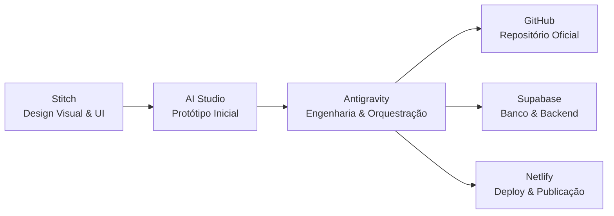
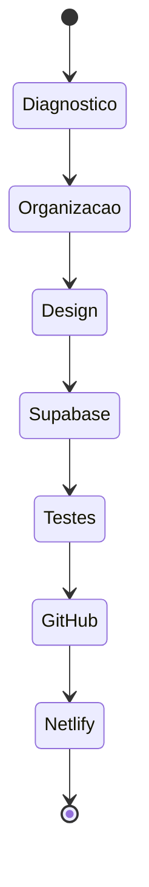

# Playbook Mestre — Orquestração de Projeto de Produtividade

Este documento serve como o **Playbook de Orquestração** para o desenvolvimento do nosso aplicativo e site de produtividade. Ele define a arquitetura, as responsabilidades das ferramentas, o fluxo de execução e a stack recomendada para o sucesso do projeto.

---

## 🧭 Visão Geral & Arquitetura Recomendada

A arquitetura ideal para o desenvolvimento do projeto combina design, prototipação rápida, engenharia de software e infraestrutura de nuvem:



Essa sinergia permite explorar variações de interface e exportar componentes com eficiência, garantindo que o código seja limpo, versionado, integrado e publicado de forma profissional.

---

## 🎯 1. Missão do Agente

O agente Antigravity deve atuar como **arquiteto, desenvolvedor full-stack, DevOps e guardião de qualidade** do projeto.

### Foco da Fase Atual: Portal Hub de Produtividade (LifeOS)
Nesta fase inicial, o objetivo é construir o core operacional do portal, onde o usuário que já tem acesso gerencia suas rotinas:
* **Dashboard Principal:** Painel unificado com resumo diário e ações rápidas.
* **Módulo de Hábitos:** Checklist interativo e histórico semanal.
* **Módulo de Atividades:** Gerenciador de tarefas (lista ou quadro simples).
* **Módulo de Finanças:** Controle de despesas rápidas e limites.
* **Módulo de Metas:** Acompanhamento de progresso de OKRs pessoais.
* **Estrutura de Rotas:** Navegação organizada e limpa no padrão Next.js App Router.
* **Persistência de Dados:** Integração robusta com o Supabase via Server Actions e migrations versionadas.
* **Hospedagem e CI/CD:** Deploy contínuo configurado no Netlify.

---

## 🛡️ 2. Regra Principal de Arquitetura

> [!IMPORTANT]
> O projeto deve ser tratado como um produto real e não como um protótipo descartável.

Embora o **AI Studio** e o **Stitch** gerem excelentes pontos de partida rápidos, cabe ao **Antigravity** revisar, limpar, refatorar e estruturar o código de forma sustentável antes de publicá-lo.

Nenhuma alteração ou recurso deve ser publicado em produção sem:
1. Revisão detalhada da estrutura de pastas.
2. Limpeza de códigos redundantes e comentários desnecessários.
3. Padronização e componentização da interface.
4. Uso estrito de variáveis de ambiente para dados sensíveis.
5. Sucesso na execução do build local.
6. Cobertura de testes básicos de integração para formulários e ações críticas.
7. Commit descritivo no GitHub.
8. Validação visual e funcional via Deploy Preview no Netlify.

---

## 💻 3. Stack Recomendada

Para o portal de produtividade:

| Tecnologia | Escolha Recomendada | Observações |
| :--- | :--- | :--- |
| **Framework** | Next.js (App Router) | Garante escalabilidade e segurança com suporte a Server Actions e React Server Components (RSC). |
| **Linguagem** | TypeScript | Garante tipagem estática e segurança contra bugs comuns. |
| **Estilos** | Tailwind CSS | Agiliza o desenvolvimento de interfaces responsivas. |
| **Componentes**| `shadcn/ui` ou componentes próprios | Garante consistência visual e acessibilidade baseada em Radix UI. |
| **Banco & Auth**| Supabase Postgres & Auth | Solução de banco de dados relacional com políticas robustas de acesso (RLS). |
| **Deploy** | Netlify | Excelente suporte para Next.js App Router, com builds rápidos e previews automáticos. |
| **Versionamento**| GitHub | Fonte oficial de verdade do código. |
| **Orquestração**| Antigravity + MCPs | Controle e automação via agentes inteligentes. |

---

## 🛠️ 4. Divisão de Responsabilidades

| Ferramenta | Papel no Fluxo |
| :--- | :--- |
| **Stitch** | Criação da identidade visual, layouts, design system e telas conceituais do dashboard. |
| **AI Studio** | Geração do protótipo funcional inicial para validação de interações de fluxo e tela. |
| **Antigravity** | Refatoração de código, integração de APIs, versionamento, testes e deploy. |
| **Supabase** | Banco de dados, autenticação de usuários, storage e APIs seguras. |
| **GitHub** | Versionamento, histórico de alterações, controle de branches e issues. |
| **Netlify** | Hospedagem, gerenciamento de builds, variáveis de ambiente e deploy previews. |

---

## 🚀 5. Fluxo Ideal de Execução

### Fase 0 — Preparação
Antes de iniciar o código, garanta a configuração de todo o ecossistema:
1. Conta no GitHub.
2. Projeto criado no Supabase.
3. Conta ativa no Netlify.
4. Antigravity instalado e pronto.
5. Node.js 22 ou superior instalado localmente.
6. Supabase CLI instalado localmente para controle de migrations.
7. MCP GitHub configurado.
8. MCP Supabase configurado.
9. MCP Netlify configurado (`npx -y @netlify/mcp`).
10. Estrutura do projeto local criada.
11. Repositório local conectado ao GitHub.

---

### Fase 1 — Design no Stitch
**Objetivo:** Definir a direção visual e a estética operacional do portal (LifeOS).

*Use o prompt abaixo no Stitch para criar a interface:*
```txt
Crie o design de um portal de produtividade pessoal moderno, responsivo e altamente funcional chamado "LifeOS".
Este é um painel fechado para usuários que já possuem acesso à plataforma, portanto, foque em usabilidade, leitura de dados e ações rápidas.

Seções/Telas do Dashboard Principal:
1. Painel de Boas-Vindas & Ações Rápidas:
   - Mensagem de saudação personalizada com barra de progresso do dia (ex: "Seu dia está 45% concluído").
   - Atalhos flutuantes rápidos: "Nova Tarefa", "Registrar Hábito", "Lançar Despesa".
2. O Painel "Hoje" (Resumo Diário Integrado):
   - Hábitos do Dia: checklist visual compacto com acompanhamento de progresso semanal (segunda a domingo).
   - Tarefas Prioritárias: lista rápida das 3 principais tarefas para hoje.
   - Resumo Financeiro: saldo disponível e progresso do limite diário de gastos.
3. Módulos Gerais (Previews Visuais):
   - Hábitos: gráficos de streaks (sequências) e frequência mensal.
   - Atividades: visualização simplificada das tarefas em progresso (Kanban ou Lista).
   - Finanças: gráfico rápido de categorias de gastos no mês.
   - Metas: progresso de OKRs ativos em barras de porcentagem.
4. Insights & Relatórios:
   - Cruzamento inteligente de dados (ex: "Sua produtividade aumenta nas quartas-feiras quando cumpre a meta de sono").
5. Menu de Navegação Lateral / Superior Responsivo:
   - Links rápidos para os painéis completos de Atividades, Finanças, Metas, Relatórios e Configurações.

Estilo visual:
- Dark Mode moderno e confortável para uso diário prolongado (paleta em grafite profundo e tons de cinza escuro).
- Destaques suaves e com significado de cor: azul para tarefas, verde para hábitos concluídos, amarelo/laranja para finanças, violeta para metas de longo prazo.
- Estilo "Glassmorphism" com fundos translúcidos e bordas super finas.
- Responsividade fluida (mobile-first) focada em acessibilidade e bom contraste de texto.
```

**Resultados esperados:**
* Capturas de tela do design em `/design/stitch/screenshots`
* Código base exportado em `/design/stitch/code-export`
* Guia de design documentado em `/design/DESIGN_GUIDE.md`

---

### Fase 2 — Protótipo no AI Studio
**Objetivo:** Criar uma versão web navegável com as principais interações de adição de tarefas, logs rápidos e troca de abas.

*Use o prompt abaixo no AI Studio para gerar o protótipo inicial:*
```txt
Crie um protótipo web responsivo do portal de produtividade "LifeOS".
Este é um sistema fechado (painel de usuário) focado em controle diário, sem apelos promocionais de venda ou captura de e-mails de marketing.

Use Next.js (App Router), TypeScript e Tailwind CSS.

Rotas a serem estruturadas:
1. Dashboard (/): A tela inicial com saudação dinâmica, ações rápidas, resumo de hábitos diários, tarefas urgentes e painel financeiro.
2. Atividades (/atividades): Tela com gerenciador de tarefas em formato Kanban ou lista interativa (A Fazer, Em Andamento, Concluído).
3. Finanças (/financas): Painel com fluxo de caixa simples e lançamento de receitas/despesas com categoria.
4. Metas (/metas): Listagem de objetivos com controle de progresso.
5. Relatórios (/relatorios): Gráficos simples simulando o cruzamento de hábitos e tarefas realizadas.
6. Configurações (/configuracoes): Preferências de perfil e gerenciamento de integrações.

Componentes Chave:
- Sidebar de Navegação Lateral (fixa em desktop, colapsável/sanduíche em mobile).
- Modal / Menu de Ações Rápidas: para lançamento simplificado de dados em qualquer tela.
- Checkbox personalizado para Hábitos do dia (com feedback visual instantâneo ao marcar).
- Cards interativos com estados hover refinados.

Requisitos não funcionais obrigatórios:
- HTML5 Semântico: marcações estruturadas corretas (<aside>, <main>, <header>, <section>).
- SEO Básico: tags de metadados dinâmicos apropriados para painéis internos.
- Acessibilidade: suporte a navegação por teclado nos formulários e contraste adequado no tema escuro.
- Preparar o código para persistência segura das ações via Server Actions no Supabase.
```

---

## 🤖 6. Prompt Mestre para o Antigravity

*Este é o prompt principal a ser fornecido ao agente Antigravity para guiar o desenvolvimento do projeto:*

```txt
Você é o agente principal de engenharia deste projeto.

Contexto:
Estamos desenvolvendo o portal operacional do "LifeOS", um ecossistema completo e integrado de produtividade para controle pessoal de hábitos, atividades, finanças, metas e relatórios de rotina. Não faremos uma landing page promocional, mas sim o portal interativo de usuário final.

Ferramentas disponíveis:
- Stitch: usado para criar o design visual e referência de UI.
- AI Studio: usado para gerar o protótipo inicial de rotas.
- Supabase: banco de dados relacional e backend do portal.
- GitHub: repositório oficial e versionamento.
- Netlify: deploy e publicação.
- Antigravity: orquestrador principal com MCP para GitHub, Supabase e Netlify.

Sua missão:
Transformar o protótipo do painel em um sistema real, limpo, versionado, testável e publicável.

Objetivo da fase atual:
Criar e publicar o portal de usuário inicial (Dashboard, Hábitos, Atividades, Finanças, Metas e Configurações), integrado ao Supabase.

Stack desejada:
- Next.js (App Router)
- TypeScript
- Tailwind CSS
- Supabase JS Client
- Deploy via Netlify
- Repositório GitHub organizado

Regras obrigatórias:
1. Nunca expor chaves de API no front-end.
2. Nunca commitar arquivos .env, tokens, secrets ou credenciais.
3. Usar variáveis de ambiente locais e remotas para integração com o Supabase.
4. Criar código limpo, componentizado, com acessibilidade e semântica HTML.
5. Priorizar responsividade mobile-first para facilitar registros diários no celular.
6. Criar commits pequenos e descritivos.
7. As gravações no Supabase devem ser realizadas através de Server Actions para segurança adicional.
8. Antes de deploy em produção, rodar linter, typecheck, testes unitários/integração e build.
9. Usar deploy preview antes de produção.
10. Documentar decisões técnicas.

Entregáveis obrigatórios:
1. Estrutura de projeto organizada utilizando Next.js App Router.
2. Portal funcional completo com navegação entre Dashboard, Atividades, Finanças, Metas e Configurações.
3. Integração inicial com Supabase via Next.js Server Actions para persistência segura de dados.
4. Tabelas Supabase para tarefas, hábitos e despesas criadas via migrações do Supabase CLI.
5. Variáveis de ambiente configuradas no projeto local e na nuvem.
6. Repositório GitHub com README e histórico limpo.
7. Deploy preview no Netlify.
8. Deploy produção no Netlify somente após build e testes aprovados.
9. Documentação em /docs.
10. Plano de evolução para o app futuro.

Fluxo de trabalho:
1. Inspecione o projeto atual.
2. Identifique stack, dependências e estrutura.
3. Crie ou reorganize a arquitetura de pastas baseada no Next.js App Router.
4. Implemente layout com base no design do Stitch.
5. Aproveite o protótipo do AI Studio apenas como referência, refatorando o que for necessário.
6. Configure o cliente do Supabase e as Server Actions para tarefas e hábitos.
7. Crie o arquivo de migração local no Supabase CLI (`supabase/migrations/`) para as tabelas iniciais.
8. Conecte os formulários e checklists às Actions.
9. Configure variáveis no ambiente local e no Netlify.
10. Implemente um teste básico de renderização e envio de dados utilizando Vitest ou Playwright.
11. Rode lint, typecheck, testes e build.
12. Corrija erros.
13. Faça commit no GitHub.
14. Abra deploy preview no Netlify.
15. Valide o site publicado.
16. Gere documentação final.

Modelo de banco inicial Supabase (Migrations locais):
Tabelas necessárias:
1. habits (id, user_id, name, days_completed, created_at)
2. tasks (id, user_id, title, status, priority, due_date, created_at)
3. transactions (id, user_id, amount, category, type, description, date, created_at)

Políticas de Acesso (RLS):
- Habilitar RLS em todas as tabelas.
- Apenas o usuário autenticado dono dos registros pode ler e escrever os dados.

Páginas do portal:
1. / (Dashboard)
2. /atividades
3. /financas
4. /metas
5. /relatorios
6. /configuracoes

Componentes:
- Sidebar
- Header
- DailyHabitsList
- PriorityTasksList
- FinanceQuickView
- TaskKanban
- TransactionForm
- QuickActionsModal
- GoalProgressBar
- Footer

Arquivos de documentação:
- README.md
- docs/ARCHITECTURE.md
- docs/DATABASE.md
- docs/DEPLOY.md
- docs/ROADMAP.md
- docs/DESIGN_SYSTEM.md

Critérios de aceite:
- Portal abre localmente sem erros.
- Testes automatizados executam com sucesso.
- Portal passa no build.
- Interface responsiva com excelente contraste no tema escuro.
- Logs e novos registros gravam no Supabase via Server Actions.
- Nenhuma chave sensível exposta.
- Deploy preview e produção funcionais no Netlify.

Ao executar, sempre pense como engenheiro de software sênior:
- primeiro entenda;
- depois planeje;
- depois implemente;
- depois teste;
- depois publique;
- depois documente.
```

---

## 📁 7. Estrutura Ideal do Repositório

```text
lifeos-site/
├─ app/                         # Roteamento baseado em pastas (Next.js App Router)
│  ├─ actions/                  # Next.js Server Actions (ex: tasks.ts, habits.ts)
│  ├─ page.tsx                  # Dashboard Home Page (Painel de entrada)
│  ├─ atividades/               # Quadro Kanban / Lista de Atividades
│  ├─ financas/                 # Gestão financeira / Fluxo de caixa
│  ├─ metas/                    # Acompanhamento de Metas e OKRs
│  ├─ relatorios/               # Insights consolidados e gráficos
│  └─ configuracoes/            # Painel de perfil e conexões do sistema
├─ components/                  # Componentes reutilizáveis de interface
│  ├─ layout/                   # Sidebar, Header, MobileMenu
│  ├─ sections/                 # Componentes específicos (DailyHabitsList, TaskKanban, etc)
│  ├─ forms/                    # Formulários (QuickActionsModal, TransactionForm)
│  └─ ui/                       # Componentes base (botões, inputs, cards - shadcn style)
├─ lib/                         # Integrações de terceiros e utilitários
│  ├─ supabase/                 # Configurações do Supabase
│  │  └─ client.ts              # Cliente para chamadas de banco (anon key)
│  └─ utils.ts                  # Classes utilitárias do Tailwind e helpers genéricos
├─ docs/                        # Documentação técnica do projeto
│  ├─ ARCHITECTURE.md           # Visão geral da arquitetura de software
│  ├─ DATABASE.md               # Estrutura do banco de dados e políticas
│  ├─ DEPLOY.md                 # Guia de implantação contínua (Netlify/GitHub)
│  ├─ ROADMAP.md                # Planejamento das próximas sprints e recursos
│  └─ DESIGN_SYSTEM.md          # Paleta de cores, tipografia e espaçamentos
├─ public/                      # Assets estáticos (imagens, ícones, logos, fontes)
├─ supabase/                    # Migrações e configurações do Supabase CLI
│  ├─ migrations/               # Arquivos de migração SQL versionados (habits, tasks, transactions)
│  └─ config.toml               # Configuração local do Supabase
├─ tests/                       # Testes automatizados (ex: dashboard.test.ts, habits.test.ts)
├─ .env.example                 # Exemplo de configuração de chaves públicas/privadas
├─ .gitignore                   # Lista de arquivos ignorados no versionamento
├─ netlify.toml                 # Configurações de deploy no Netlify
├─ package.json                 # Dependências do projeto, scripts npm e vitest
├─ README.md                    # Documento de boas-vindas e setup local do projeto
└─ tsconfig.json                # Configuração do compilador TypeScript
```

---

## 🗄️ 8. Modelo Inicial de Tabelas Supabase (Migrations)

Exemplo de estruturação de migração local (`/supabase/migrations/`) para suportar os módulos básicos:

```sql
-- supabase/migrations/20260619000000_init_schema.sql

-- Habilitar UUID
create extension if not exists "uuid-ossp";

-- Tabela de Hábitos
create table if not exists public.habits (
  id uuid primary key default uuid_generate_v4(),
  user_id uuid references auth.users(id) on delete cascade not null,
  name text not null,
  streak_count integer default 0,
  days_completed text[] default '{}', -- Ex: ['2026-06-19', '2026-06-20']
  created_at timestamptz default now()
);

-- Tabela de Atividades (Tarefas)
create table if not exists public.tasks (
  id uuid primary key default uuid_generate_v4(),
  user_id uuid references auth.users(id) on delete cascade not null,
  title text not null,
  status text not null default 'A Fazer', -- 'A Fazer', 'Em Andamento', 'Concluído'
  priority text not null default 'Média', -- 'Baixa', 'Média', 'Alta'
  due_date date,
  created_at timestamptz default now()
);

-- Tabela de Transações Financeiras
create table if not exists public.transactions (
  id uuid primary key default uuid_generate_v4(),
  user_id uuid references auth.users(id) on delete cascade not null,
  amount numeric(12,2) not null,
  category text not null,
  type text not null, -- 'Receita', 'Despesa'
  description text,
  date date not null default current_date,
  created_at timestamptz default now()
);

-- Habilitando RLS em todas as tabelas
alter table public.habits enable row level security;
alter table public.tasks enable row level security;
alter table public.transactions enable row level security;

-- Políticas de segurança: Apenas o próprio usuário acessa seus dados
create policy "Users can manage their own habits" on public.habits
  for all to authenticated using (auth.uid() = user_id);

create policy "Users can manage their own tasks" on public.tasks
  for all to authenticated using (auth.uid() = user_id);

create policy "Users can manage their own transactions" on public.transactions
  for all to authenticated using (auth.uid() = user_id);
```

---

## 🔑 9. Variáveis de Ambiente

Estrutura do arquivo `.env.example` para o portal:

```env
# Chaves públicas para acesso no front-end
NEXT_PUBLIC_SUPABASE_URL=your-supabase-project-url
NEXT_PUBLIC_SUPABASE_ANON_KEY=your-supabase-anon-key

# Chaves privadas usadas estritamente nas Server Actions (segurança extra)
SUPABASE_SERVICE_ROLE_KEY=your-supabase-service-role-key
```

---

## 🔌 10. Configuração MCP — Papel de Cada Conexão

Os servidores MCP gerenciam a esteira operacional do LifeOS:
* **GitHub MCP**: Versionamento do portal, organização das pastas no padrão Next.js App Router e controle de Pull Requests.
* **Supabase MCP**: Provisionamento local e remoto do banco de dados, execução de migrações estruturais das tabelas de hábitos, tarefas e finanças.
* **Netlify MCP**: Hospedagem da aplicação, injeção de secrets de ambiente e monitoramento de builds de produção e homologação (previews).

---

## 🪜 11. Ordem Correta de Trabalho no Antigravity

A esteira de desenvolvimento do portal operacional segue a ordem:



---

## ✅ 12. Critérios de Pronto (Definition of Done)

O portal operacional só será considerado entregue ao usuário após a validação dos seguintes itens:

* [ ] O portal abre localmente em ambiente de desenvolvimento sem warnings.
* [ ] O build de produção do Next.js compila sem erros de linter ou TypeScript.
* [ ] Testes de integração (envio do form de tarefas/hábitos) passam com sucesso.
* [ ] Layout desktop do painel operacional validado e limpo.
* [ ] Layout mobile responsivo de alta performance para registros rápidos.
* [ ] Gravação de hábitos, tarefas e despesas gravando perfeitamente no Supabase.
* [ ] RLS (Row Level Security) protegendo os dados individuais dos usuários.
* [ ] Nenhum token ou credencial privada exposta no repositório.
* [ ] README descrevendo os comandos de instalação e migrations.
* [ ] Pasta `/docs` com a arquitetura e esquema do banco preenchidos.
* [ ] Deploy preview validado no Netlify.
* [ ] Aplicação de produção publicada e funcional.

---

## 🗺️ 13. Roadmap Recomendado de Lançamento (LifeOS)

```carousel
### Versão 0.1: Core Operacional
- Dashboard Home unificado
- Checklist diário de hábitos
- Controle simples de tarefas (Kanban)
- Lançamentos financeiros básicos
- Banco integrado via Supabase RLS
- Deploy no Netlify
<!-- slide -->
### Versão 0.2: Insights & Metas
- Módulo de acompanhamento de Metas/OKRs
- Relatórios estatísticos iniciais
- Gráficos integrados de evolução semanal
- Otimização do mobile para uso diário
<!-- slide -->
### Versão 0.3: Integrações & Customização
- Integração com Google Calendar e GitHub
- Modo Escuro e Modo Foco customizáveis
- Relatórios mensais em PDF
- Notificações push de lembretes
<!-- slide -->
### Versão 1.0: LifeOS Completo
- Sincronização offline em tempo real
- Assistente de IA de produtividade integrado
- Controle avançado de investimentos (finanças)
- Rastreamento avançado de rotinas semanais
```

---

## 🌟 14. Regras de Ouro e Práticas Recomendadas

Antes de realizar qualquer alteração estrutural no código do projeto, o agente Antigravity deve declarar e explicar:
1. **O que foi compreendido** do requisito solicitado.
2. **Quais arquivos** serão alterados ou adicionados.
3. **Quais impactos ou riscos** técnicos podem surgir.
4. **Como as alterações serão testadas** (localmente ou via scripts).

### Links de Referência Úteis:
* 📑 [From idea to app: Introducing Stitch](https://developers.googleblog.com/stitch-a-new-way-to-design-uis/)
* ⚡ [Set up Antigravity for Netlify](https://docs.netlify.com/build/build-with-ai/agent-setup-guides/set-up-antigravity-for-netlify/)
* 🧪 [Build apps in Google AI Studio](https://ai.google.dev/gemini-api/docs/aistudio-build-mode)
* 🛢️ [Supabase MCP Server Guide](https://supabase.com/docs/guides/ai-tools/mcp)
* 🐙 [GitHub MCP Server Repository](https://github.com/github/github-mcp-server)
